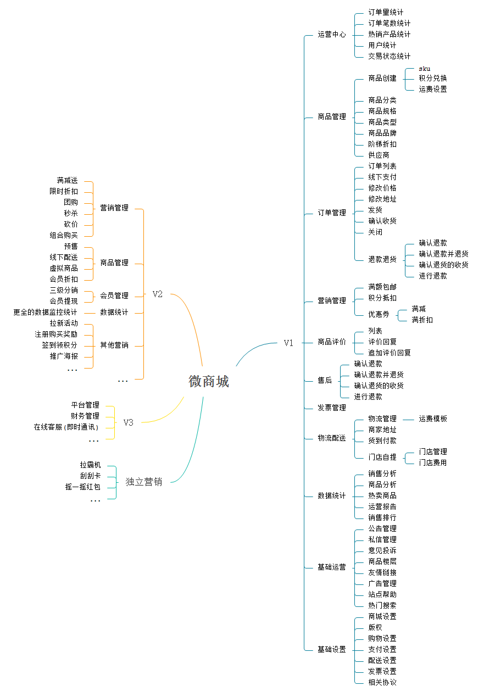

## RF 微商城

### 前言

基于 [RageFrame2](https://github.com/jianyan74/rageframe2) 的一款免费开源的基础商城销售功能的开源微商城，前端基于 uni-app，一端发布多端通用，目前已经适配 H5、微信小程序、QQ小程序、Ios App、Android App。目前开源的版本功能为 V1 版，更多增强功能(V2、V3)敬请期待。


### 项目地址

[前端开源地址](https://github.com/stavyan/TinyShop-UniApp): https://github.com/stavyan/TinyShop-UniApp

[Uni-App插件地址](https://ext.dcloud.net.cn/plugin?id=1427): https://ext.dcloud.net.cn/plugin?id=1427

[后端开源地址](https://github.com/jianyan74/TinyShop): https://github.com/jianyan74/TinyShop

### Demo

[H5 预览](http://h5.tinyshop.rageframe.com): http://h5.tinyshop.rageframe.com

Android App体验版 [下载](http://b2c.rageframe.com/attachment/files/2020/07/06/__UNI__8006C11_0706181408.apk)

[后台预览](http://demo.rageframe.com/backend): http://demo.rageframe.com/backend

账号: demo
密码: 123456


### 商业版Demo

[H5 预览](http://uniapp.rageframe.com ): http://uniapp.rageframe.com

[后台预览](http://b2c.rageframe.com/backend): http://b2c.rageframe.com/backend
账号: demo
密码: 123456

小程序二维码


### 更新记录

#### v1.2.1

updated 2020.08.06

- 修复：前端更改默认主题
- 新增: 主页快速导航组件

> [更多更新记录](docs/UPDATE.md)

### 思维导图



### 安装说明

1、安装相关依赖, 默认已拥有node环境

```
// 安装yarn命令
npm i -g yarn
// 安装依赖
yarn
```

2. 运行到指定平台

```
// 运行到H5
npm run serve
// 运行至对应的小程序平台
npm run dev:PLATFORM
```

值 | 平台
---|---
h5 | H5
mp-weixin | 微信小程序
mp-alipay | 支付宝小程序
mp-baidu | 百度小程序
mp-toutiao | 头条小程序
mp-qq | qq 小程序


3. 打包至线上部署W
```
// H5打包
npm build
npm build:PLATFORM // 平台信息同上
```
使用对应的小程序客户端进行发布。

4、发布uni-app(打包为原生App云端)

配合HBuilderX使用

> 注： H5除主页外刷新页面会出现404 需配置nginx伪静态

```
location / {
    try_files $uri $uri/ /index.html;
}
```

### 配置文件

> [详见配置说明](docs/CONFIG.md)

### 官网

http://www.lizidata.com

### 问题反馈

- 在使用中有任何问题，欢迎反馈给我，可以用以下联系方式跟我们交流
- QQ群1：[123](https://jq.qq.com/?_wv=17&k=4B)

### 特别鸣谢

感谢以下的项目，排名不分先后
- Vuejs： https://github.com/vuejs/vue
- uni-app： https://uniapp.dcloud.io/
- mix-mall: https://ext.dcloud.net.cn/plugin?id=200
- ColorUI: https://github.com/weilanwl/ColorUI
- ...

### 版权信息

	
	项目包含的第三方源码和二进制文件之版权信息另行标注。																																																																																																																																																																																																																																																																																																																								

	版权所有Copyright © 2016-2020 by RageFrame [www.lizidata.com](http://www.lizidata.com)

All rights reserved。
LICENSE-SUPPLEMENTAL.md


## Project Structure
项目大概结构

- ├── src(uniapp源码目录)
- ├── ├── api(api数据处理)
- ├── ├── ├── basic.js
- ├── ├── └── websocket.js
- ├── ├── App.vue(应用配置)
- ├── ├── common(公用配置文件)
- ├── ├── ├── graceChecker.js
- ├── ├── ├── jweixin.js
- ├── ├── ├── moment.js
- ├── ├── ├── router.js
- ├── ├── └── utils.js
- ├── ├── components(unu-app组件目录)
- ├── ├── ├── rf-avatar
- ├── ├── ├── └── rf-avatar.vue(可复用组件)
- ├── ├── config(详细配置文件)
- ├── ├── ├── assets.config.js
- ├── ├── ├── constData.config.js
- ├── ├── ├── formRule.config.js
- ├── ├── ├── index.config.js
- ├── ├── ├── routes.config.js
- ├── ├── └── websocket.config.js
- ├── ├── Json.js
- ├── ├── main.js(vue初始化入口文件)
- ├── ├── manifest.json(配置应用名称、各种版本打包信息)
- ├── ├── pages(单独组件目录)
- ├── ├── ├── cart
- ├── ├── ├── category
- ├── ├── ├── index
- ├── ├── ├── ├── notice
- ├── ├── ├── └── search
- ├── ├── ├── order
- ├── ├── ├── ├── create
- ├── ├── ├── ├── evaluation
- ├── ├── ├── ├── refund
- ├── ├── ├── └── shipping
- ├── ├── ├── product
- ├── ├── ├── public
- ├── ├── ├── ├── logintype.vue
- ├── ├── ├── ├── login.vue
- ├── ├── ├── ├── password.vue
- ├── ├── ├── └── register.vue
- ├── ├── ├── set
- ├── ├── ├── ├── about
- ├── ├── ├── ├── authorization
- ├── ├── ├── ├── feedback
- ├── ├── ├── ├── invoice
- ├── ├── ├── └── set.vue
- ├── ├── └── user
- ├── ├── ├── ├── account
- ├── ├── ├── ├── address
- ├── ├── ├── ├── collection
- ├── ├── ├── ├── coupon
- ├── ├── ├── ├── footprint
- ├── ├── ├── ├── money
- ├── ├── ├── ├── userinfo
- ├── ├── ├── └── user.vue
- ├── ├── pages.json(项目基本信息)
- ├── ├── static(静态资源文件夹)
- ├── ├── store(vuex)
- ├── ├── uni.scss(sass公用css)
- ├── ├── utils(封装request插件目录)
- ├── ├── ├── graceChecker.js
- ├── ├── ├── helper.js
- ├── ├── ├── payment.js
- ├── ├── ├── request
- ├── ├── ├── ├── index.js
- ├── ├── ├── └── request.js
- ├── ├── └── router.js
- ├── .editorconfig(代码分风格规范)
- ├── .eslintignore(不需要eslint校验规则的文件夹)
- ├── .eslintrc.js(eslint的校验规则)
- ├── .gitignore(git不需要提交的文件夹)
- ├── .prettierignore(代码格式化插件)
- ├── .prettierrc(代码自动化格式插件)
- ├── babel.config.js(js编译器)
- ├── postcss.config.js(css预处理)
- ├── package.json(module描述文件)
- ├── tsconfig.json(TypeSCript配置)
- └── vue.config.js(webpack配置文件)
